# Cortex Speech — Architecture & Technical Overview

> Offline-first desktop app for **Central Kurdish (Sorani)** speech transcription, transcript curation, and ML dataset export.
> Default engine: the fine-tuned **OmniASR-7B Champion** running locally on the GPU. Everything works without a network; cloud is opt-in and off by default.

**Stack:** Tauri v2 + Svelte 5 (runes) + Rust + SQLite/FTS5 · ~102 IPC commands · EN + CKB (RTL) i18n
**Repo:** github.com/HawzhinBlanca/cortex-speech · `main @ 4787d81` · generated 2026-06-30

*Solid violet = OmniASR-7B Champion primary path (default). Dashed = cloud (opt-in, off by default).*

---

## 1 · What it is

Cortex Speech turns raw long-form audio (podcasts, interviews, audiobooks) into a clean, human-verified, license-aware speech dataset for a low-resource language. The workflow:

`import → VAD chunk → ASR (7B Champion) → align words → jury adjudicate → human review → validate → export`

**Design principles**

- **Offline-first** — local ASR + alignment + storage; no network needed.
- **Honesty-first** — machine output is never shown as human-verified; every transcript carries engine provenance; metrics come only from real runs.
- **Consent-gated cloud** — voice is biometric data (GDPR Art. 9); cloud STT/LLM require explicit opt-in.
- **Human-in-the-loop** — a jury auto-adjudicates the easy cases and escalates the rest to a fast review UI; the human decision is final.

---

## 2 · End-to-end pipeline (Rust core)

Import is dispatched from `import_audio_file` / `import_directory` (commands.rs), which spawn a background worker so the UI never blocks. `ProcessingPipeline` (pipeline.rs) runs each file through:

| Stage | What happens | Key functions / files |
|---|---|---|
| **Decode** | Audio → 16 kHz mono PCM. Short files decode whole; long files stream in 90 s windows. | `decode_to_pcm_with_timeout`, `decode_pcm_windows`, `should_stream_decode` |
| **VAD chunk** | Silero VAD finds speech regions; merged/split/absorbed to honor min/max length (no mid-word cuts, no spanning long silences). | `voice_activity_detection`, `plan_speech_chunks` (chunking.rs) |
| **ASR dispatch** | Each chunk transcribed by the active engine (default: 7B Champion). | `build_segments_from_pcm`, `transcribe` (pipeline.rs) |
| **Normalize** | Sorani normalization (numerals, hamza/y-k) → `normalized_transcript`; text stored NFC. | `SoraniNormalizer` (normalizer.rs) |
| **Align (words)** | Forced alignment → per-word start/end for tap-a-word review. MMS-CTC, falls back to bundled aligner / energy heuristic. | `align_via_finetuned_mms`, `ctc_logits_to_word_timestamps` |
| **Persist** | Segments + multi-model hypotheses written transactionally; FTS5 auto-syncs. | `persist_segments`, `insert_segments_batch` (db.rs) |
| **7B primary pass** | When 7B is the engine, each segment is (re-)transcribed via the warm WSL server with retry. **Fail-hard:** server unreachable ⇒ import cancelled and segments rolled back. | `run_primary_wsl_pass_for_import` |

After persistence the jury runs on a **separate WAL DB connection** so adjudication never starves the UI.

---

## 3 · ASR engines

Routing by `settings.asr_model_size` (default **WSL7B**) + `use_finetuned_asr` + consent flags.

| Engine | model_id | Runtime | Role |
|---|---|---|---|
| **OmniASR-7B Champion** ★ | `omniasr-wsl-7b` | base omniASR-LLM-7B-v2 + LoRA, fairseq2+PEFT, ~31 GB, WSL GPU server `127.0.0.1:8799` | **Primary / default** — the owner's fine-tuned 7B; produces every import transcript |
| OmniASR-CTC 300M | `omniasr-ctc-300m` | sherpa-onnx, ~50 MB | Bundled local fallback / default-downloadable |
| OmniASR-CTC 1B | `omniasr-ctc-1b` | sherpa-onnx, ~500 MB | Larger base CTC (opt-in) |
| Fine-tuned MMS-1B | `finetuned-mms-ckb` | Wav2Vec2-CTC via `ort`, ~970 MB, ~18.6% CER | Word alignment + opt-in per-clip re-transcribe |
| ElevenLabs Scribe | `scribe-v1` | Cloud REST (opt-in) | Cloud STT / jury vote — only with `cloud_stt_opt_in` |

> **"Which model" answer:** there is no base-vs-fine-tuned-7B ambiguity. The OmniASR-7B Champion *is* the fine-tuned 7B (base + LoRA). The fine-tuned **MMS-1B** is a separate, smaller model used mainly for word-timing alignment. Out of the box, transcripts are 100% the 7B Champion.

The 7B request loop: the Rust pipeline spawns `wsl python3 cortex_7b_client.py --segment-id <id>` → the client reads the clip from the app DB → asks the warm `cortex_7b_server.py` on `:8799` (loads the 31 GB model once on the GPU) → returns `__RESULT__={"raw_transcript": …}`. The client fails loudly (non-zero exit, no result) on any infrastructure error, which the pipeline turns into a fail-hard cancel.

---

## 4 · Jury — automatic adjudication

A multi-tier confidence router on its own DB connection:

- **T0 — IRT consensus gate:** per-segment hypotheses are aligned into a confusion network and voted by an Item-Response-Theory model; a calibrated **conformal threshold** + hypothesis-coverage guard decide auto-accept vs escalate. `fit_irt_consensus`, `quality/irt.rs`, `jury/mod.rs`.
- **T1 — tool evidence:** text-level grounding / consistency checks.
- **T2 — audio judge (opt-in):** a cloud model (Gemini) *listens* and adjudicates; gated by `jury_cloud_opt_in`. `jury/t2_listener.rs`.
- **Escalation:** unresolved segments enter the **Review Inbox** ordered lowest-confidence-first; the **Autonomy Dial** (Observe → Propose → ActConfirm → ActAuto) sets unattended depth.

> For this data the three Sorani ASR models agree only ~40–65% (the two CTC models are architecturally related, so their agreement is correlated and the gate vetoes it) — so the jury mostly escalates, which is why fast human review matters.

---

## 5 · Human review

`ReviewMode.svelte` — a distraction-free, one-clip-at-a-time loop. The human decision is authoritative and is never overwritten by later jury runs.

**Review actions**
- **Word-timing playback** — tap a word to hear it; karaoke highlight; playback bounded to the clip span.
- **Model-provenance badge** — *"Draft by &lt;engine&gt; — machine draft, not human-verified"*, drawn from recorded hypotheses (never inferred).
- **Re-transcribe this clip** — OmniASR-7B (server) or Fine-tuned MMS-1B (CPU); resets `verified=false`.
- **Mark bad** — records a human *reject*: excluded from export, kept and reversible.

**Learning flywheel** — decisions become `human_accept` / `human_edit` / `human_reject`; confirmed corrections feed `agent_examples` (few-shot retrieval); a LOOP-0 memory can auto-apply confirmed fixes (opt-in).

---

## 6 · Storage

SQLite (WAL) + FTS5 + 25 migrations. A shared mutex-guarded connection serves UI commands; the jury uses its own WAL connection.

| Table | Holds |
|---|---|
| `speech_segments` | core row: raw/normalized/annotated transcript, `alignment_json` (word timings + source window), `verified`, `verdict`, `human_decision`, audio QC fields, `model_version_id`, gold flag |
| `segment_hypotheses` | per-model drafts `(segment_id, model_id, transcript, confidence, model_version_id)` — source of the provenance badge + jury vote |
| `source_transcripts` | whole-file reference transcripts |
| `agent_examples` / `gold_segments` / `eval_runs` | few-shot flywheel, held-out gold sets, scorecards |
| `model_versions` / `schema_migrations` / `segments_fts` | model registry, migration ledger, full-text index |

---

## 7 · Validation & export

Honesty-gated dataset build with three guardrails:

- **Quality gates:** WER/CER thresholds (`enforce_quality_gates`) + per-segment **training grade** — `gold` / `silver` / `review` / `reject`.
- **Leakage guards:** held-out gold clips excluded by content-hash + path (fail-closed even if the file is missing); HuggingFace splits are **speaker-disjoint** via a union-find guard.
- **Privacy:** curator/local paths redacted from published datasets.

**Formats:** JSON / JSONL, CSV (formula-injection-safe), Parquet, HuggingFace datasets, WAV/FLAC clips + metadata, DPO preference pairs.

---

## 8 · Privacy & consent

100% offline by default. Cloud only behind explicit, acknowledged opt-in:

- `cloud_stt_opt_in` — ElevenLabs Scribe STT
- `cloud_llm_opt_in` — OpenRouter / Gemini LLM refinement
- `jury_cloud_opt_in` — the Gemini T2 audio judge

`settings.effective_llm_mode()` downgrades cloud → none whenever the flag is off; the pipeline re-checks consent before building any refiner. API keys are never persisted in tracked files; voice is biometric data with consent + license enforced before any publish/train step.

---

## 9 · State as of this build

Landed on `main`, verified by cargo fmt/clippy + **823** Rust tests, typecheck/lint + **129** vitest, **20** Python policy gates, and repo-hygiene:

| Commit | Change |
|---|---|
| `48bde15` | Integrated a 68-commit hardening line into the branch (30 conflicts reconciled, combining both sides' intent). |
| `1a9ae00` | **OmniASR-7B Champion forced as the default** + fail-hard import (cancel + rollback when the 7B server is down); sanitized client repo-tracked. |
| `4787d81` | **Review feature:** per-clip re-transcribe (7B / MMS-1B), model-provenance badge, mark-bad — verified live on the real app. |

---

*This document is descriptive; the code is authoritative. Canonical sources: `CLAUDE.md`, `AGENT_CHARTER.md`, `docs/`.*
